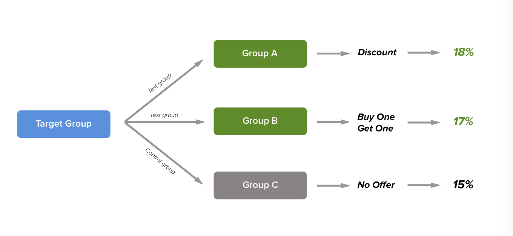
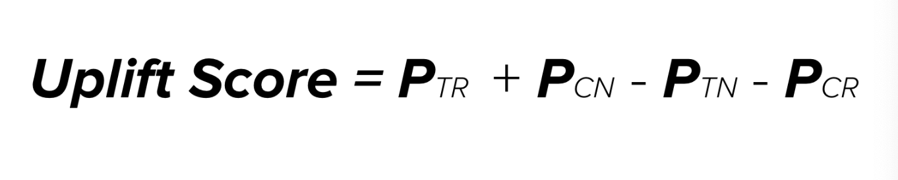

# Market Response Models & A/B Testing
---

## Executive Summary 

### Problem Statement 

We know how to segment customers, predict LTV, and future sales (see github for in-depth workflow). But the real business question is: **Are the promotional initiatives we're conducting effective? Or is the company wasting time and money?** Segmenting customers and doing A/B tests enable us to try a variety of ideas for generating incremental sales. ***Important***: We need to ideate and experiment continuously to find growth opportunities. 

Splitting the customers who we are going to send the offer into test and control groups helps us to calculate incremental gains. Let's observe the following image:

If we predict the effect of giving an offer, we can easily maximize our transactions and have a forecast of the cost. Market Response Models help us building this framework.

This repository will cover analytic procedures that measure the effect of promotional initiatives and define key metrics of consumer response in relation to company revenue. 

--

## Repository Information 

### Folders
- `datasets`
- `visuals`

### Notebooks
- `01_MarketResponseModels.ipynb`
- `02_UpliftModeling.ipynb`
- `03_AB_TestingDesign_and_Execution.ipynb`

### Dataset 

`data.csv`
- https://gist.github.com/karamanbk/ef1a118592e2f7954e5bb582e09bdde3
- Columns
    - **recency**: months since last purchase
    - **history**: $value of the historical purchases
    - **used_discount/used_bogo**: indicates if the customer used a discount or buy one get one before
    - **zip_code**: class of the zip code as Suburban/Urban/Rural
    - **is_new**: indicates if the customer new
    - **channel**: channels that the customer using, Phone/Web/Multichannel
    - **offer**: the offers sent to the customers, Discount/But One Get One/No Offer
-- 

## Repository Walkthrough

***This repository will cover work in chronological order. Please follow along!***

### `01_MarketResponseModels.ipynb` Objective: Predict Conversion Probability and Find Factors that are drivers of Incremental Change

The main goal is to use XGBoostClassifier to predict conversion probability and calculate discount uptick and compare it with the true discount uptick

The following tasks were executed:
1. Define and identify three types of uplifts (BOGO vs. Discount)
    - Conversion uplift 
    - Order Uplift 
    - Revenue Uplift 
2. Find factors that are drivers of incremental change (in terms of conversion rates)
    - Tables and graphs
3. Model the data using XGBoost Classifier
    - Here are the results 
    
    |True Discount Promo Uptick|Predicted Discount Promo Uptick|
    |---|---|
    |907|937|
    
    |True BOGO Promo Uptick|Predicted BOGO Promo Uptick|
    |---|---|
    |573|541|

### `02_UpliftModeling.ipynb` Objective: Model the incremental impact of promotional offers by predicting uplift score 

**Note**: Each customer has four probabilities (TR, TN, CR, CN)

The following image displays the calculation of uplift score: 

The following tasks were executed:
1. Feature Engineering
    - Segment customers based on treatment and control 
    - Then find respondents and non respondents within each group 
    - Cluster based on history
    - Use data on treatment and control to create target labels(0,1,2,3)
2. Model the data
    - Utilized XGBoostClassifier 
    - predict_proba => each customer gets four probabilities (TR, TN, CR, CN)
    - Then calculate uplift score for all customers 
3. Evaluating the model 
    - Benchmark the dataset (based on BOGO or Discount)
    - Calculate uptick for Discount campaign in the upper quantile 
    - Calculate uptick for Discount campaign in the lower quantile 
4. Key Insights from upper quantile discount campaign
    - Revenue uplift per targeted customer increased by 63%
        - From $1.91 to $3.13
    - Approximately 24% of the discounted group contributes 40% of the discount revenue 
    
**Overall, we used this model to make campaigns more efficient by targeting specific segments based on the uplift score. In addition, we can try different promotional offers based on uplift scores**

### `03_AB_TestingDesign_and_Execution.ipynb` Objective: Design and Execute A/B Testing Framework

**Note**
- This is simply designing and understanding A/B testing frameworks. More repositories on A/B testing will come!
- Since this notebook identifies aspects of A/B testing frameworks, we created out dataset using numpy

The following tasks were executed:
1. Calculate the statistical significance of uptick in test group 
    - Using scipy.stats
2. Covering the common way to select test and control groups 
    - random sampling (very important)
    - pandas sample function 
        - Note: The ratio between segments (HV and LV) in the test group must be equal to the ratio between segments in the control group 
3. One-Way Anova (no test and control)
    - Reason why it's one-way
        - One segment only
        - All high-value customers split into three different groups (aka three different promotional offers)
        - One-way anova can tell us if purchased counts are significant 
4. Two-way Anova (segment and group)
    - Segment: High value or low value
    - Group: Control or Test
5. Finding the substanital sample size for statisitical significance 
    - Must require target ratio
        - For example, I want to increase average purchase count by X%
    - Alpha is typically 5%

## Conclusions 

Here is a summary of what we did in each notebook:

1. `01_MarketResponseModels.ipynb` 
    - **Objective**: Calculate discount uptick using predicted conversion probability and find key drivers that effect the incremental change on conversion. 
    - **Process**: Plotly graphs on version, KMeans cluster, XGBoostClassifier
    - **Importance**: Modeling conversion rates will help businesses to make better decisions. By predicting, businesses can identify prospective customers who are likely to buy or have the highest propensity. Essentially, conversion rates predict success or failure. 
    
2. `02_UpliftModeling.ipynb`
    - **Objective**: Predict uplift score for each customer to see impact on direct marketing action, which is the incremental impact of a treatment. 
    - **Process**: Feature engineering, XGBoostCLassifier, Benchmarking, Campaign analysis based on quantiles
    - **Importance**: Modeling uplift scores will help campaigns more efficient by targeting specific segmemts. We can also provide different promtional offers based on the uplift score. Lastly, this model helps us predict the incremental response of a marketing action. 
    
3. `03_AB_TestingDesign_and_Execution.ipynb`
    - **Objective**: Design and execute A/B testing framework
    - **Process**: statistical significance, sampling, one-way anova, two-way anova, substantial sample size 
    - **Importance**: Predictions are only predictions; it isn't as informative as real-world experimentation. A/B testing is the best way to test ML models; it also tells you if you're going in the right direction (so you don't need to waste time and money). 

